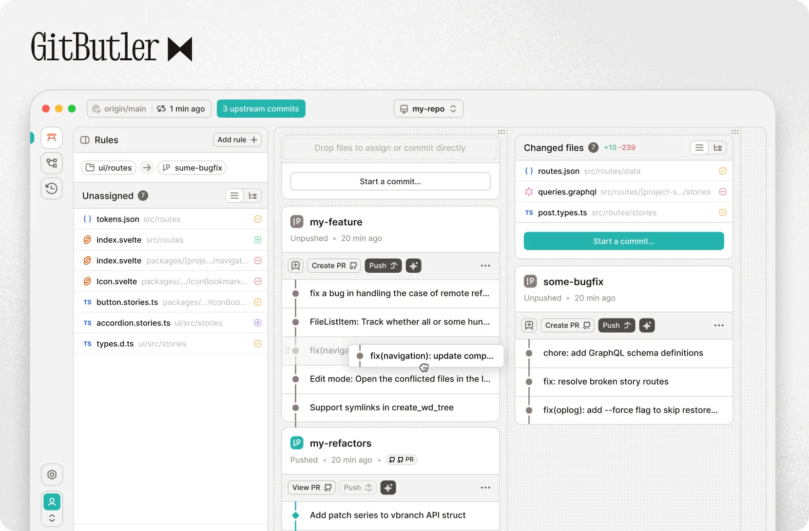



  

   
   

  

    面向现代、AI 驱动工作流从零打造的版本控制工具。
     
     
    <a href="https://gitbutler.com">官网</a>
    &nbsp;&nbsp;?&nbsp;&nbsp;
    <a href="https://blog.gitbutler.com/">博客</a>
    &nbsp;&nbsp;?&nbsp;&nbsp;
    <a href="https://docs.gitbutler.com/">文档</a>
    &nbsp;&nbsp;?&nbsp;&nbsp;
    <a href="https://gitbutler.com/downloads">下载</a>
  

[![TWEET][s1]][l1] [
![BLUESKY][s8]][l8 ] [![DISCORD][s2]][l2]

[![CI][s0]][l0] [![INSTA][s3]][l3] [![YOUTUBE][s5]][l5] [![DEEPWIKI][s7]][l7]

[s0]: https://github.com/gitbutlerapp/gitbutler/actions/workflows/push.yaml/badge.svg
[l0]: https://github.com/gitbutlerapp/gitbutler/actions/workflows/push.yaml
[s1]: https://img.shields.io/badge/Twitter-black?logo=x&logoColor=white
[l1]: https://twitter.com/intent/follow?screen_name=gitbutler
[s2]: https://img.shields.io/discord/1060193121130000425?label=Discord&color=5865F2
[l2]: https://discord.gg/MmFkmaJ42D
[s3]: https://img.shields.io/badge/Instagram-E4405F?logo=instagram&logoColor=white
[l3]: https://www.instagram.com/gitbutler/
[s5]: https://img.shields.io/youtube/channel/subscribers/UCEwkZIHGqsTGYvX8wgD0LoQ
[l5]: https://www.youtube.com/@gitbutlerapp
[s7]: https://deepwiki.com/badge.svg
[l7]: https://deepwiki.com/gitbutlerapp/gitbutler
[s8]: https://img.shields.io/badge/Bluesky-0285FF?logo=bluesky&logoColor=fff
[l8]: https://bsky.app/profile/gitbutler.com

 

GitButler 是一个 Git 客户端，让你可以同时在多个分支上工作。
它允许你快速将文件更改整理到独立分支，同时仍应用在你的工作目录中。
随后你可以单独推送分支到远程，或直接创建拉取请求。

简而言之，它是 `git add -p` 和 `git rebase -i` 的更灵活版本，让你能够在多个分支间高效并行处理。

## 工作原理

GitButler 在 Git 之上维护一层用于跟踪未提交更改的记录。对文件或文件片段的更改可以被归入我们称为虚拟分支的分组中。当你对某个虚拟分支的内容满意时，可以将其推送到远程。GitButler 会确保其他虚拟分支的状态彼此隔离。

## GB 的虚拟分支与 Git 分支有何不同？

Git 中我们熟悉的分支像是不同的宇宙，切换它们意味着完全切换上下文。GitButler 允许你在同一工作目录中并行处理多个分支，这等于同时拥有多个分支的内容。

GitButler 能感知提交前的变更，因此它可以记录每个 diff 归属的虚拟分支。也就是说，你可以随时把某个虚拟分支的内容独立出来推送到远程，或从工作目录中取消应用。

最后，在 Git 中通常需要提前创建目标分支，而在 GitButler 中你可以在开发过程的任意阶段在虚拟分支之间移动更改。

## 为什么选择 GitButler？

我们热爱 Git。我们的 [@schacon](https://github.com/schacon) 甚至出版了 [Pro Git](https://git-scm.com/book/en/v2)。但 Git 的用户界面已经有 15 年没有发生根本变化。当初它是为 Linux 内核开发者通过邮件列表互发补丁而设计的，而如今多数开发者的工作流与需求早已不同。

我们没有尝试把 Git CLI 的语义硬塞进图形界面，而是从开发者工作流出发，再映射回 Git。

## 技术栈

GitButler 是基于 [Tauri](https://tauri.app/) 的应用。其 UI 使用 [Svelte](https://svelte.dev/) 与 [TypeScript](https://www.typescriptlang.org) 编写，后端使用 [Rust](https://www.rust-lang.org/) 编写。

## 主要特性

- **虚拟分支**
  - 在多个分支上同时组织工作，而不是频繁切换分支
  - 需要时自动创建新分支
- **便捷的提交管理**
  - 通过拖拽撤销、修订和压缩提交
- **撤销时间线**
  - 记录所有操作和变更，便于轻松撤销或回退任何操作
- **GitHub 集成**
  - 通过 GitHub 认证，创建拉取请求、列出分支与状态等
- **便捷的 SSH 密钥管理**
  - GitButler 可生成 SSH 密钥并自动上传到 GitHub
- **AI 工具**
  - 根据你的进行中工作自动生成提交信息
  - 自动生成描述性的分支名
- **提交签名**
  - 使用 GPG 或 SSH 轻松签名提交

## 使用示例

### 在开发功能时修复 Bug

> 假设你在开发功能时遇到一个 Bug，希望将修复作为独立贡献（Pull Request）发布。

使用 Git 时，你可以将更改暂存并切换到另一个分支，然后提交并推送修复。

_使用 GitButler_ 时，你只需把修复分配到一个独立的虚拟分支，即可单独推送（或直接创建 PR）。额外好处是，你可以在等待 CI 和/或代码审查时仍保留这些修复在工作目录中。

### 在继续自己工作时试用他人的分支

> 假设你想为代码审查测试他人的分支。

使用 Git 试用他人分支需要完全切换上下文，离开自己的工作。
_使用 GitButler_，你可以直接在工作目录中应用或取消应用（添加/移除）任何远程分支。

## 文档

用户文档见：<https://docs.gitbutler.com>

## 问题与功能请求

如果你有 bug 或功能请求，欢迎打开 [issue](https://github.com/gitbutlerapp/gitbutler/issues/new)，
或 [加入我们的 Discord 服务器](https://discord.gg/MmFkmaJ42D)。

## AI 提交信息生成

提交信息生成是可选功能。你可以在首次添加仓库时启用，或在项目设置中启用。

目前，GitButler 使用 OpenAI 的 API 来总结 diff，这意味着启用后，代码 diff 会发送到 OpenAI 的服务器。

我们的目标是让该功能更模块化，未来你可以修改提示词并接入其他 LLM 端点（包括本地）。

## 贡献

想贡献？请查看 [CONTRIBUTING.md](CONTRIBUTING.md) 文档。

如果你想直接开始让代码编译，请查看 [DEVELOPMENT.md](DEVELOPMENT.md)。

### 贡献者

